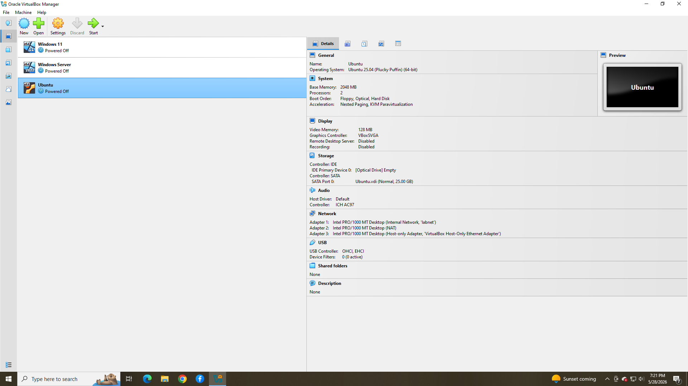
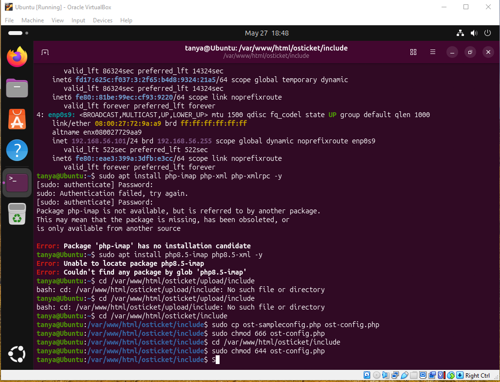
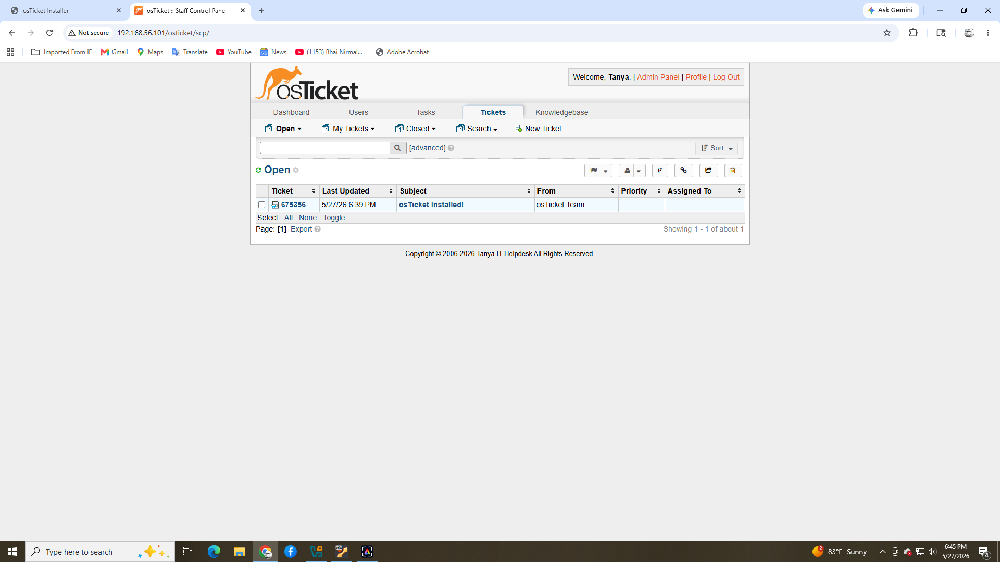

# ubuntu-helpdesk-lab
Built a Linux-based help desk environment using Ubuntu and osTicket within a virtualized lab environment. Configured and tested ticket management workflows to simulate real-world IT support operations.

_____

## Technologies Used
- Ubuntu Linux
- osTicket
- Apache
- PHP
- MySQL
- VirtualBox
_____

## Ubuntu Server Setup
Created an Ubuntu virtual machine and configured the environment for hosting osTicket.
- Ubuntu Installation
- Network Configuration
- Package Updates
- Apache Installation
- PHP and MySQL configuration

_____

## osTicket Installation
Installed and configured osTicket within the Ubuntu environment.
- Help desk portal
- User Access

